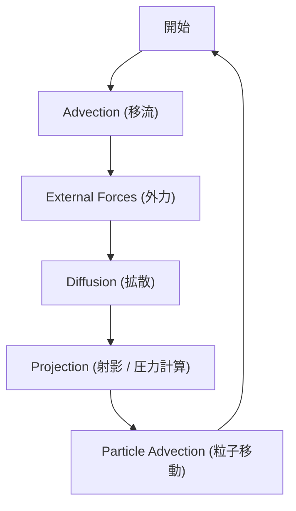

# 流体シミュレーション技術仕様書

## 1. 支配方程式 (物理モデル)

本シミュレーションは、流体力学における **非圧縮性ナビエ・ストークス方程式** を解いています。

### 運動量保存則 (Momentum Equation)

流体の動きを表すナビエ・ストークス方程式です：

```
∂u/∂t = -(u・∇)u - (1/ρ)∇p + ν∇²u + f
```

この式の各項は、流体の動きに影響を与える「力」を表しています直感的な意味は以下の通りです：

1.  **左辺 `∂u/∂t` (時間変化)**:
    - 次の瞬間の速度がどう変化するか（加速度）を表します。

2.  **右辺第1項 `-(u・∇)u` (移流項)**:
    - 「慣性」によって流れが運ばれる効果です。流体が自分自身の速度で移動することによる変化を表します。本シミュレーションの「Advection」ステップで計算されます。

3.  **右辺第2項 `-(1/ρ)∇p` (圧力項)**:
    - 圧力の高い方から低い方へ押し出される力です。流体の「非圧縮性（縮まない性質）」を保つために重要な項で、「Projection」ステップで計算されます。

4.  **右辺第3項 `ν∇²u` (粘性項)**:
    - 流体の「粘り気」による摩擦力です。周囲との速度差を均そうとする拡散効果として働きます。「Diffusion」ステップに相当します。

5.  **右辺第4項 `f` (外力項)**:
    - 重力や、マウスによる操作など、外部から加わる力です。

これらを合わせることで、「今の速度」から「次の瞬間の速度」を決定しています。

### 連続の式 (Continuity Equation / 非圧縮性条件)

流体の体積が変わらない（縮まない）ことを表す式です：

```
∇・u = 0
```

---

## 2. 数値解法 (Numerical Implementation)

**Stable Fluids** (Jos Stam, 1999) の手法を採用し、タイムステップを複数の操作に分割して計算します。

### ワークフロー図



### ステップ詳細と対応する関数

以下は `src/solver_cpu.py` (および `_gpu.py`) 内の実際の関数との対応です。

#### 1. Advection (移流項)
無条件安定性を得るために **セミラグランジュ法 (Semi-Lagrangian Method)** を使用します。
- **対応する関数**: `advect()`
- **実装**: `cupyx.scipy.ndimage.map_coordinates` (GPU版) または Numba の三線形補間 (CPU版)。
- **式**: `u_new(x) = u_old(x - u_old(x) * dt)`

#### 2. Diffusion (拡散項)
粘性を扱う項ですが、本シミュレーション（サラサラした流体）では処理負荷軽減のため省略されています（非粘性流体近似）。
- **対応する関数**: なし (本実装ではスキップ)
- **一般的な式**: `u_new = (u_old + alpha * neighbors) / (1 + 6 * alpha)`

#### 3. Projection (射影)
流体の非圧縮性を保つ工程です。質量保存則を満たすように速度場を修正します。

1. **発散の計算**: `divergence_calc()`
   - 速度場の湧き出し（Divergence）を計算します。
   - `div = ∇・u`
2. **圧力の計算**: `pressure_jacobi()`
   - ポアソン方程式をヤコビ法で反復計算し、圧力を求めます。
   - `∇²p = div`
3. **勾配の減算**: `project()`
   - 計算された圧力勾配を速度場から引くことで、非圧縮な流れにします。
   - `u_final = u - ∇p`

#### 4. Particle Update (粒子移動)
- **対応する関数**: `advect_particles()`
- **処理**: 速度場に従って粒子を移動させ、壁やパイプとの衝突判定、色の更新、リサイクル処理を行います。
- **GPU版**: `RawKernel` (`advect_particles_gpu`) で高速に並列処理されます。

---

## 3. 境界条件 (Boundary Conditions)

### 自由配置可能な流入口/流出口
4つの側面 (左右上下) の任意の面にポートを設定できます。

- **流入口 (Inlet)**: 選ばれた面の $(y, z)$ 領域に対して、固定速度 $\mathbf{u}_{inlet}$ を強制します。
- **流出口 (Outlet)**: 吸い込み速度を適用するか、または単に流出端として機能します。
- **壁面 (Walls)**: パイプの「穴」以外のグリッド境界においては、スリップなし/あり条件 ($\mathbf{u} \cdot \mathbf{n} = 0$) を適用します。

### 粒子 (Particles)
粒子は速度場によって運ばれる受動トレーサーとして機能します。

- **動力学**: $\mathbf{p}_{new} = \mathbf{p}_{old} + \mathbf{u}(\mathbf{p}_{old}) \Delta t$
- **リサイクルロジック**:
  - 流出口パイプの深部 (> depth 20) に到達した粒子は、自動的に流入口に再配置 (Respawn) されます。
  - 速度や状態 (吸収済み/アクティブ) に基づいて色が変化します。

---

## 4. GPU最適化 (CuPy 実装)

$10^5$ 個以上の粒子をリアルタイムで扱うため、CuPy を用いた CUDA カーネルを利用しています。

### メモリレイアウト
- **速度場**: `(res_x, res_y, res_z, 3)` - 4次元テンソルとして保持。`map_coordinates` によるアクセスに最適化。
- **粒子**: フラットな配列 `(N * 3)` または `(N, 3)` を使用し、カスタムカーネルでのメモリアクセス効率を高めています。

### カスタムカーネル戦略
複雑な分岐条件（壁衝突判定、パイプ内判定など）を含む粒子更新ループには、`cp.RawKernel` を使用しています。これにより、Pythonループのオーバーヘッドを回避し、GPU上で直接計算を行います。

```cpp
// 粒子カーネルの擬似コード
__global__ void update_particles(...) {
    int i = threadIdx.x + blockIdx.x * blockDim.x;
    float3 pos = particles[i];
    float3 vel = sample_velocity(field, pos);
    
    // 境界チェック & パイプロジック
    if (in_outlet_pipe(pos)) {
        recycle_particle(i);
    }
    
    pos += vel * dt;
    particles[i] = pos;
}
```
